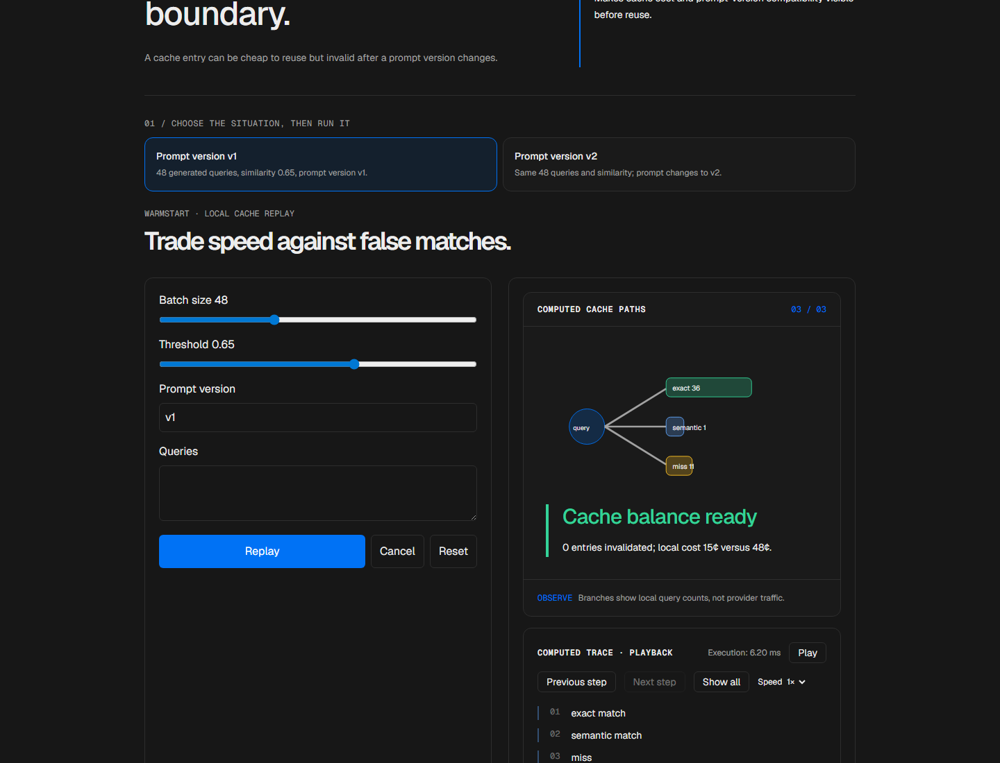
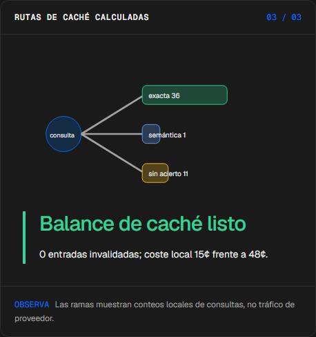
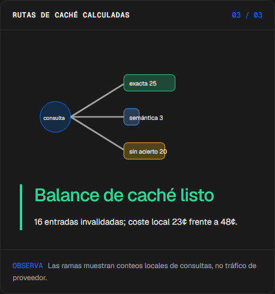
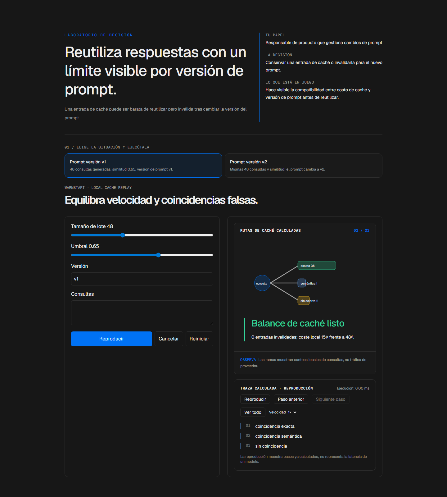

# Warmstart

<!-- community-badges -->
[](https://github.com/mdeasis27/warmstart/actions/workflows/ci.yml) [](LICENSE)
<!-- /community-badges -->

[English](README.md) · [Probar demo](https://warmstart-manueldeasis27-2515s-projects.vercel.app/es/app) · [Caso de estudio](https://portafolio-mdea.vercel.app/es/projects/warmstart) · [Código](https://github.com/mdeasis27/warmstart)



Edita lotes de preguntas, umbrales de similitud y versiones para inspeccionar rutas de caché.

## Dos situaciones para comparar

**Prompt versión v1:** 48 consultas generadas, similitud 0.65, versión de prompt v1. Las entradas sembradas pueden seguir la ruta exacta de caché.



**Prompt versión v2:** Mismas 48 consultas y similitud; el prompt cambia a v2. El cambio de versión invalida las entradas sembradas.



## Caso de uso de negocio

Una entrada de caché puede ser barata de reutilizar pero inválida tras cambiar la versión del prompt.

**Quién lo usa:** Responsable de producto que gestiona cambios de prompt.

**La decisión:** Conservar una entrada de caché o invalidarla para el nuevo prompt.

Elige prompt v1 o v2, inspecciona la llave de caché sembrada y lee la ruta de acierto o invalidación.

### Prueba la decisión

**Prompt versión v1:** 48 consultas generadas, similitud 0.65, versión de prompt v1. Las entradas sembradas pueden seguir la ruta exacta de caché.

**Prompt versión v2:** Mismas 48 consultas y similitud; el prompt cambia a v2. El cambio de versión invalida las entradas sembradas.

Elige un escenario, modifica sus controles y ejecuta el cálculo local. Avanza por la visualización paso a paso o revela todo. Reinicia antes de comparar el segundo escenario.

## Cómo probarlo

Abre `/en/app` (inglés, por defecto) o `/es/app` (español). Cambia los datos del escenario y ejecuta el cálculo. Inspecciona la decisión, evidencia y traza calculada. La reproducción revela pasos locales ya completados; no mide un modelo en vivo. Reiniciar empieza un escenario local nuevo. Cambiar de idioma reinicia el escenario.

La demo principal no requiere cuenta, clave de API ni base de datos. Los enlaces públicos apuntan al despliegue existente; el rediseño local está pendiente de publicación.

<!-- recruiter-mission:start -->
### Tu misión interactiva

Carga intenciones parecidas, inspecciona los pares consulta | intención, predice opcionalmente un acierto falso y reproduce para comparar tu umbral de similitud con 0.95. Las consultas introducidas sustituyen el lote generado.

El reto usa tres consultas etiquetadas. Con similitud 0.35 produce un acierto semántico falso y costo de lote de 1¢; con 0.95 produce cero aciertos semánticos falsos y costo de 2¢. Consultas, orden, caché inicial y versión no cambian. Un fallo incorpora una entrada, por lo que las rutas posteriores pueden divergir.

**Por qué este enfoque:** La similitud léxica y las etiquetas ficticias explican por qué un acierto barato puede reutilizar la respuesta equivocada. La referencia 0.95 no garantiza corrección; no son embeddings ni salida de un modelo en vivo.

**Antes de producción:** Validar consultas reales etiquetadas, aciertos falsos exactos/semánticos, aislamiento entre usuarios, permisos, caducidad e invalidación. Tarifas ilustrativas: 100¢ por 1,000 aciertos y 1,000¢ por 1,000 fallos, agregadas con un único redondeo superior al centavo entero por lote; precios y latencia reales requieren medición aparte.

Editar datos, elegir un escenario o reiniciar borra la predicción y los resultados anteriores. La comparación aparece al completar la reproducción; las demos principales no requieren cuenta ni llave.

El piloto de misiones actualiza esta implementación. Las capturas e informes de navegador existentes documentan la etapa anterior; las comprobaciones de interacción y capturas nuevas están pendientes por bloqueos del entorno actual.
<!-- recruiter-mission:end -->

## Instalación y verificación local

Requiere Node.js 22 y pnpm 10.

```sh
pnpm install --frozen-lockfile
pnpm dev
pnpm test
node node_modules/typescript/bin/tsc --noEmit --incremental false
pnpm lint
pnpm build
```

Abre `http://localhost:3000/en/app`. La validación registrada cubre pruebas, lint, TypeScript y builds de producción. Consulta los [resultados de comandos](docs/quality/decision-lab-verification.json) y las [comprobaciones de componentes en navegador](docs/quality/decision-lab-browser.json). Estas pruebas usan componentes React y CSS de producción con navegación de idioma controlada; no certifican rutas de Next ni el despliegue público.

## Arquitectura

- `app/[lang]/`: experiencia web por idioma.
- `lib/experience/`: adaptador local tipado, validación y trazas.
- `design-system/`: tokens visuales, controles de idioma y presentación de ejecución y reproducción.
- `app/api/`: integraciones opcionales de servidor; la demo principal no las requiere.

Tecnología: Next.js 16, TypeScript, Python, Vitest, pytest, Tailwind CSS v4.

## Evidencia y límites

Las consultas se separan en ramas exacta, semántica y sin acierto con conteos calculados. Los totales finales muestran invalidaciones por versión de prompt y costos del prototipo.

Hits exactos y semánticos, misses e invalidación; costos con supuestos explícitos en centavos enteros.

Hace visible la compatibilidad entre costo de caché y versión de prompt antes de reutilizar.

**Límites:** Las llaves y costos de caché son ejemplos locales; no se mide rendimiento ni calidad de caché. Estos prototipos de portafolio no afirman impacto medido en producción.

Los datos son ejemplos ficticios o anónimos. Las integraciones opcionales requieren sus propias credenciales y configuración. Los secretos pertenecen al gestor configurado, nunca a archivos locales de secretos ni Git. Usa el flujo existente `infisical run -- <command>` si necesitas integraciones en vivo. La demo local no publica ni despliega automáticamente.



<!-- community-section -->
## Licencia y contribución

Publicado bajo la [licencia MIT](LICENSE). Se aceptan issues y pull requests: lee antes [CONTRIBUTING.md](CONTRIBUTING.md) y el [Código de Conducta](CODE_OF_CONDUCT.md). Para reportar una vulnerabilidad, consulta [SECURITY.md](SECURITY.md).
<!-- /community-section -->
