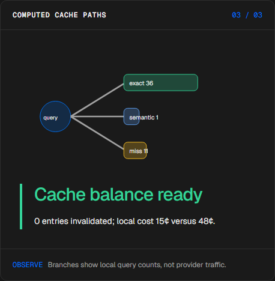
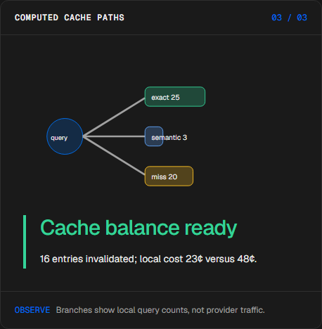
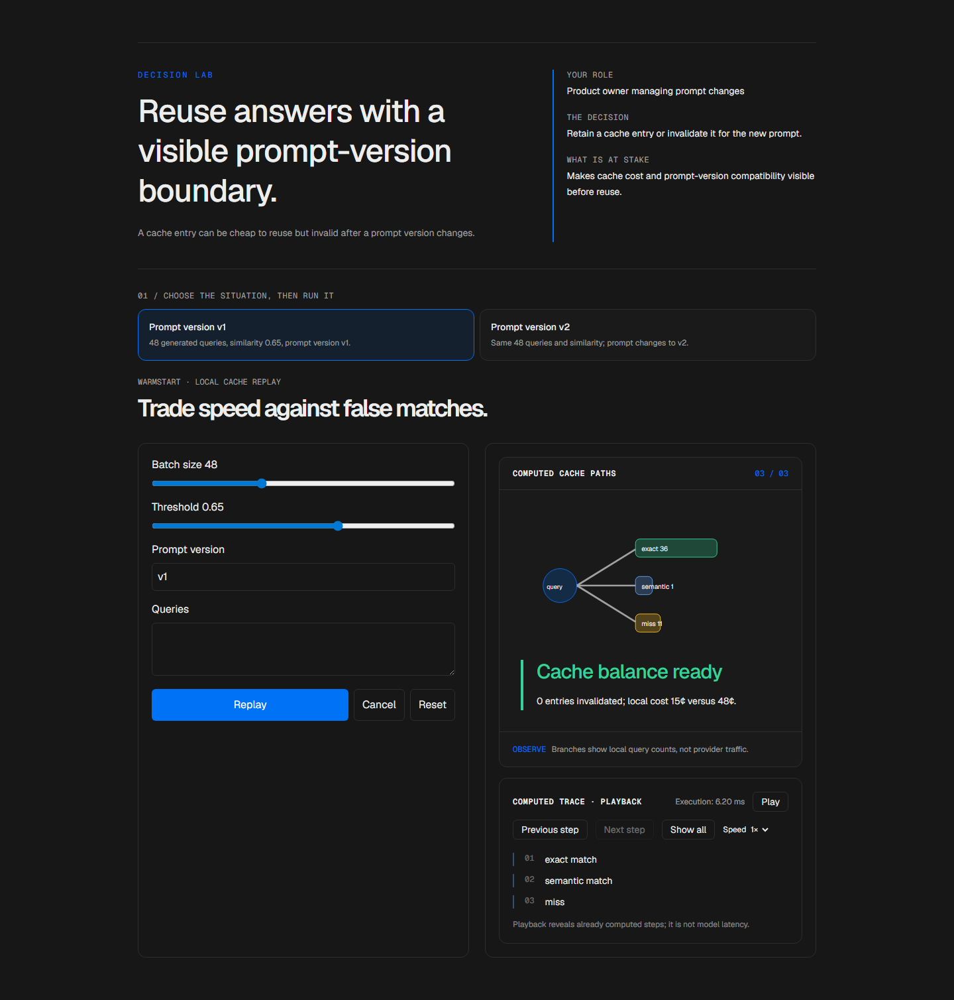

# Cache decision lab

<!-- community-badges -->
[](https://github.com/mdeasis27/warmstart/actions/workflows/ci.yml) [](LICENSE)
<!-- /community-badges -->

[Español](README.es.md) · [Try the demo](https://warmstart-manueldeasis27-2515s-projects.vercel.app/en/app) · [Case study](https://manueldeasis.com/en/projects/warmstart) · [Source](https://github.com/mdeasis27/warmstart)


Edit query batches, similarity thresholds and prompt versions to inspect cache paths.

## Two situations to compare

**Prompt version v1:** 48 generated queries, similarity 0.65, prompt version v1. Seeded entries can follow the exact cache path.



**Prompt version v2:** Same 48 queries and similarity; prompt changes to v2. The version change invalidates seeded entries.



## Business use case

A cache entry can be cheap to reuse but invalid after a prompt version changes.

**Who uses it:** Product owner managing prompt changes.

**The decision:** Retain a cache entry or invalidate it for the new prompt.

Choose prompt version v1 or v2, inspect the seeded cache key, then read the hit or invalidation path.

### Try the decision

**Prompt version v1:** 48 generated queries, similarity 0.65, prompt version v1. Seeded entries can follow the exact cache path.

**Prompt version v2:** Same 48 queries and similarity; prompt changes to v2. The version change invalidates seeded entries.

Choose a scenario, edit its controls and run the local computation. Step through the visual process or reveal all steps. Reset before comparing the second scenario.

## How to try it

Open `/en/app` (English, default) or `/es/app` (Spanish). Change the scenario inputs and run the computation. Inspect the resulting decision, evidence and computed trace. Playback reveals completed local steps; it does not measure a live model. Reset starts a new local scenario. Changing language resets the scenario.

The primary demo needs no account, API key or database. Public links refer to the existing deployment; local redesign changes are pending publication.

<!-- recruiter-mission:start -->
### Your interactive mission

Load lookalike intents, inspect query | intent pairs, optionally predict a false hit, then replay and compare your similarity threshold with 0.95. Custom queries replace the generated batch.

The challenge uses three labeled queries. At similarity 0.35 it produces one false semantic hit and a 1¢ batch cost; at 0.95 it produces zero false semantic hits and a 2¢ batch cost. Queries, order, seeded cache and prompt version stay fixed. A miss inserts an entry, so later cache paths can diverge.

**Why this approach:** Lexical similarity and fictional intent labels expose why a cheap cache hit can reuse the wrong answer. The 0.95 reference is not a correctness guarantee, and this is not embedding or live model output.

**Before production:** Validate real labeled queries, false exact/semantic hits, tenant isolation, permissions, expiry and invalidation. Rates are illustrative: 100¢ per 1,000 hits and 1,000¢ per 1,000 misses, aggregated with one final rounding up to an integer cent per batch; actual prices and latency require separate measurement.

Editing inputs, choosing a preset or resetting clears the prediction and obsolete results. Comparisons appear only at completed playback; the primary demos need no account or key.

The mission pilot updates this implementation. Existing screenshots and browser reports document the previous stage; fresh browser interaction checks and captures are pending because the current environment blocked them.
<!-- recruiter-mission:end -->

## Local setup and verification

Requires Node.js 22 and pnpm 10.

```sh
pnpm install --frozen-lockfile
pnpm dev
pnpm test
node node_modules/typescript/bin/tsc --noEmit --incremental false
pnpm lint
pnpm build
```

Open `http://localhost:3000/en/app`. Recorded validation covers tests, lint, TypeScript and production builds. See [command results](docs/quality/decision-lab-verification.json) and [browser component checks](docs/quality/decision-lab-browser.json). The new browser checks exercise real React components and production CSS with controlled locale navigation; they do not certify Next routes or public deployment.

## Architecture

- `app/[lang]/`: localized browser experience.
- `lib/experience/`: typed local adapter, validation and run traces.
- `design-system/`: shared visual tokens, locale controls and execution/replay presentation.
- `app/api/`: optional server integrations; the primary demo does not require them.

Technology: Next.js 16, TypeScript, Python, Vitest, pytest, Tailwind CSS v4.

## Evidence and limitations

Queries split into exact, semantic and miss branches with computed counts. Final totals show prompt-version invalidations and prototype costs.

Exact hits, semantic hits, misses and invalidation; costs are disclosed assumptions in integer cents.

Makes cache cost and prompt-version compatibility visible before reuse.

**Limits:** Cache keys and costs are local examples; cache performance and quality are not measured. These portfolio prototypes do not claim measured production impact.

Inputs use fictional or anonymized examples. Optional live integrations require their own credentials and operational setup. Secrets belong in the configured secret manager, never in local secret files or Git. Use the existing `infisical run -- <command>` workflow when live integration is needed. This repository does not publish or deploy automatically as part of the local demo.



<!-- community-section -->
## License and contributing

Released under the [MIT License](LICENSE). Issues and pull requests are welcome: read [CONTRIBUTING.md](CONTRIBUTING.md) and the [Code of Conduct](CODE_OF_CONDUCT.md) first. To report a vulnerability, see [SECURITY.md](SECURITY.md).
<!-- /community-section -->
